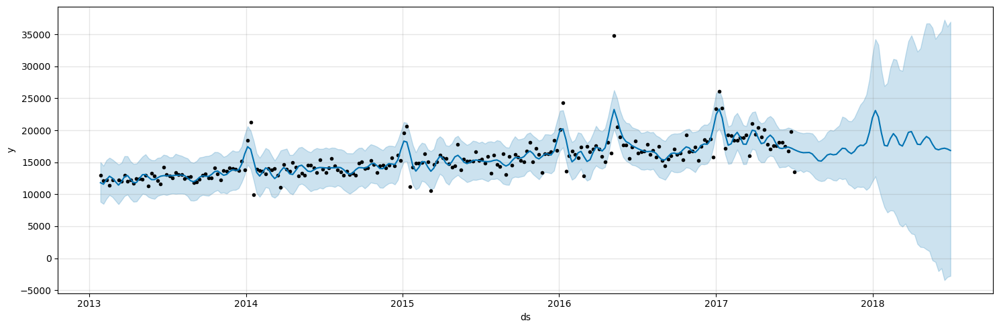
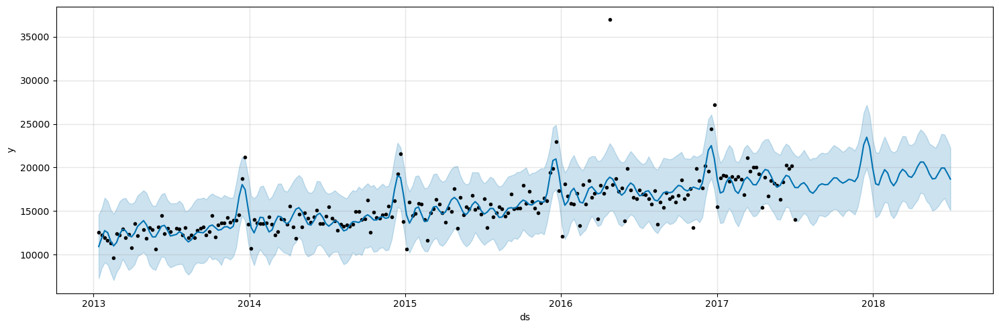

# Project Management | Data Scientist

### Technical Skills: Python, SQL, Power Bi, Machine Learning

### Languages: Spanish (_Native_) , English (_Intermediate_)

### Statistical tools: Excel


## Education:
**International business / Trade and Commerce | Universidad Autonóma de Nuevo León** (_Jan 2010 - Dec 2014_)

## Work Experience:
 Pricing/Project Management Supervisor | C.H. Robsinon (_Feb 2021 - Jan 2023_)
    
   > * Lead a group of >5 members.
   > * Optimize and deliver positive results to customers and suppliers with our produtcs
   >  (Enabling smart B2B and B2C models) with an estimated result of +2M USD in savings for operational costs.
   > * Define, develop and drive transformation accross multiple areas with efficency and
   >  efficacy.
   > * Monitoring, evaluation and reporting framework on our product results to executive-level for decision making on organization objectives (2022 objective: 2 billion USD
   > on revenue).
   > * Evaluate progress and scalability of workload within our group. Making the team
   >  being able to give service to 6 branches in the Mexican region and +50 branches
   >  within the whole division.
   > * Manpower evaluation and hiring process for new employees on our group according
   >  to our work plans.


 Project Manager | C.H. Robsinon (_Jan 2020 - Feb 2021_)
    
   > * Collaborate with different stakeholders to detect needs and plan accordingly.
   > * Deliver great customer service to our final users in +50 branches within the division.
   > * Monitoring, evaluation and reporting framework on our product progress to my
   >  manager.

# Projects: 

## [Time series sales forecasting with price simulations](https://github.com/IvanMontoya09/Time-series-forecasting-and-price-simulations)

### Overview

> This project supports supply chain industry to solve some of their painpoints on their operational execution.

> Using an accurate predictive model allows achieve better execution on operations with less spending. I used 2 scenarios to compare which is the most accurate prediction on sales:
> * Using EWMA (Exponentially Weighted Moving Average) technique
> * Using historical sales   

> A price simulation function allows to have multiple scenarios where the price set in conjunction of the sales predicted can bring a broad standpoint on business decisions.

### Project Code Snippets 

```python
# Setup and train final model on EWMA values
final_model = Prophet(changepoint_prior_scale= 0.4,
                      holidays_prior_scale = 0.1,
                      n_changepoints = 150,
                      seasonality_mode = 'multiplicative',
                      weekly_seasonality=True,
                      daily_seasonality = True,
                      yearly_seasonality = True,
                      interval_width=0.95)
final_model.fit(X_tr_weekly)

# Creating model for the next year on EWMA
future = final_model.make_future_dataframe(periods=52, freq='W')
forecast = final_model.predict(future)
forecast[['ds', 'yhat', 'yhat_lower', 'yhat_upper']].tail(7)

# Plot the forecast
f, ax = plt.subplots(1)
f.set_figheight(5)
f.set_figwidth(15)
fig = final_model.plot(forecast,ax=ax)
plt.show()

```

### EWMA PROPHET model



```python
# Setup and train final model on historical sales values
final_weekly_model = Prophet(changepoint_prior_scale= 0.5,
                      holidays_prior_scale = 0.5,
                      n_changepoints = 150,
                      seasonality_mode = 'additive',                      
                      weekly_seasonality=True,
                      daily_seasonality = True,
                      yearly_seasonality = True,
                      interval_width=0.95)
final_weekly_model.fit(X_tr_weekly)

# Creating model for the next year on historical sales
future = final_weekly_model.make_future_dataframe(periods=52, freq='W')
forecast = final_weekly_model.predict(future)
forecast[['ds', 'yhat', 'yhat_lower', 'yhat_upper']].tail(7)

# Plot the forecast
f, ax = plt.subplots(1)
f.set_figheight(5)
f.set_figwidth(15)
fig = final_weekly_model.plot(forecast,ax=ax)
plt.show()

```

### Historic Sales PROPHET model




